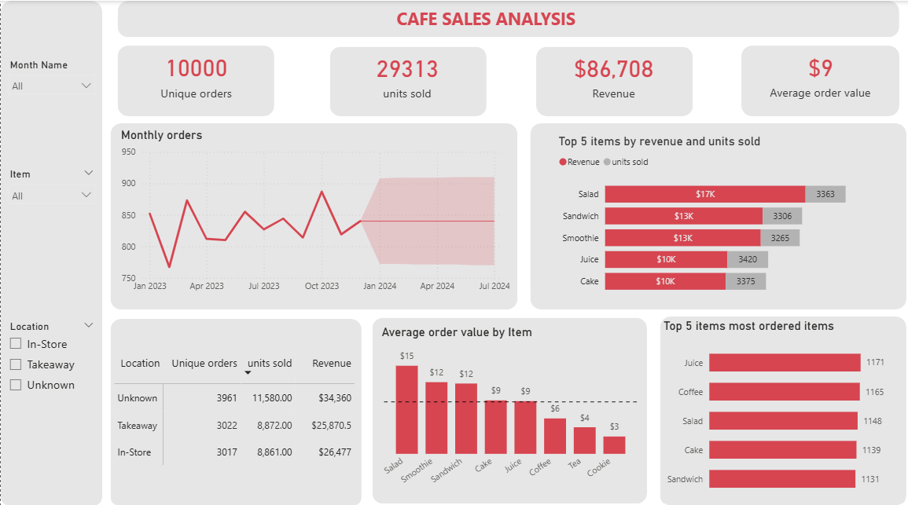

# Cafe-sales-analysis

The goal of the analysis is was implement a Power BI dashboard to uncover actionable insights into café sales performance, customer behavior, and product optimization strategies.

This project goes beyond visualization — it delivers **strategic insights and business recommendations** to improve revenue, pricing, and operational efficiency.

---

## Dashboard Overview

The dashboard provides an interactive view of café performance across:

- Sales trends  
- Product-level analytics  
- Customer purchasing behavior  
- Location-based performance  

---

## Business Objectives

The primary goals of this analysis are:

- Evaluate overall sales performance  
- Identify top-performing and underperforming products  
- Analyze customer ordering patterns  
- Optimize pricing and product mix  
- Support data-driven decision-making  

---

## 📌 Key Performance Indicators (KPIs)

| Metric                  | Value     | Insight |
|------------------------|----------|--------|
| **Unique Orders**      | 10,000   | Strong customer base and transaction volume |
| **Units Sold**         | 29,313   | High product movement |
| **Revenue**            | $86,708  | Moderate revenue relative to volume |
| **Avg Order Value**    | $9       | Indicates low-to-mid ticket purchases |

---

## Detailed Analysis & Insights

### Monthly Sales Trend
- Orders fluctuate between ~780 and ~900 monthly  
- Slight upward trend with stable forecast  

**Insight:**  
Demand is stable with no strong seasonality. Growth is steady but not accelerating.

---

### Product Performance (Revenue vs Volume)

**Top Revenue Generators:**
- Salad (~$17K)  
- Sandwich (~$13K)  
- Smoothie (~$13K)  

**Top Volume Sellers:**
- Juice (highest units sold)  
- Coffee  
- Salad  

**Insight:**  
High-volume products are not the highest revenue contributors.

---

### Most Ordered Items
- Juice  
- Coffee  
- Salad  
- Cake  
- Sandwich  

**Insight:**  
Customers prefer quick, affordable consumables → strong upsell opportunity.

---

### Average Order Value (AOV) by Product

| Product   | AOV |
|----------|-----|
| Salad    | $15 |
| Smoothie | $12 |
| Sandwich | $12 |
| Cake     | $9  |
| Juice    | $9  |
| Coffee   | $6  |
| Tea      | $4  |
| Cookie   | $3  |

**Insight:**  
Premium items drive higher revenue per transaction, but low-ticket items dominate sales volume.

---

### Location-Based Performance

| Location   | Orders | Units Sold | Revenue |
|-----------|--------|------------|---------|
| Unknown   | 3961   | 11,580     | $34,360 |
| Takeaway  | 3022   | 8,872      | $25,870 |
| In-Store  | 3017   | 8,861      | $26,477 |

**Insights:**
- “Unknown” location contributes the highest revenue but this poses a serious data quality issue  
- Takeaway and In-store performance are nearly identical  

---

## Key Business Insights

1. **Revenue Efficiency Gap**
   - High volume but low AOV ($9)  
   - Over-reliance on low-priced items  

2. **Product Mix Imbalance**
   - Best-selling is not most profitable  
   - Premium items underutilized  

3. **Customer Behavior Pattern**
   - Preference for quick, affordable items  
   - Strong opportunity for bundling and upselling  

4. **Data Quality Issue**
   - Large “Unknown” category affects decision accuracy  

5. **Stable but Flat Growth**
   - Business is consistent but not scaling rapidly  

---

## Strategic Recommendations

### Increase Average Order Value (AOV)
- Introduce bundles (e.g., Coffee + Cake)  
- Upsell at checkout  
- Offer minimum spend discounts  

---

### Optimize Pricing Strategy
- Slightly increase prices of high-demand items  
- Maintain affordability for volume drivers  
- Reposition premium products  

---

### Leverage High-Volume Products
- Bundle with premium items  
- Example:
  - Juice + Sandwich combo  
  - Coffee + Salad pairing  

---

### Improve Data Quality
- Eliminate “Unknown” location category  
- Enforce structured data capture at POS  

---

### Drive Growth
- Launch seasonal promotions  
- Target low-performing products  
- Implement loyalty programs  

---

### Product Strategy Optimization
- Promote high-margin items more aggressively  
- Reduce reliance on low-margin standalone products  

---

## 🛠️ Tools & Technologies

- **Power BI** – Dashboard development  
- **DAX** – Measures and calculations  
- **Data Modeling** – Structured analytics  

